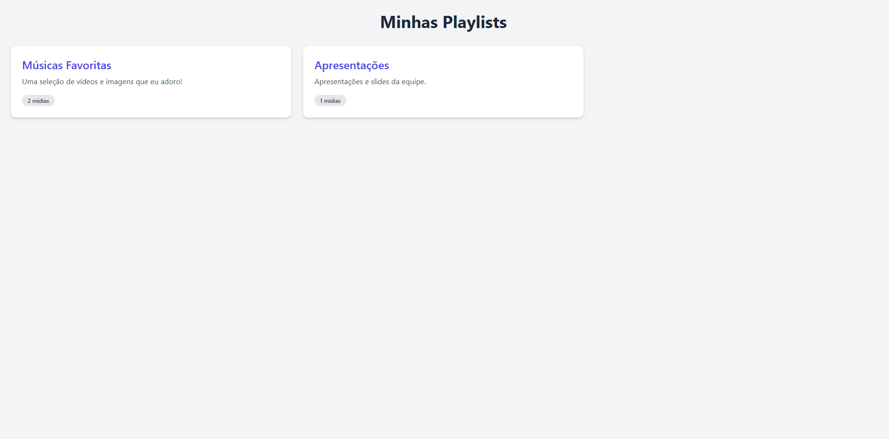

# VideoPlayer-Crialed
# Por: Pablo Lipa

<picture>
  <source media="(prefers-color-scheme: dark)" srcset="./Imagens/responsividade.png">
  <source media="(prefers-color-scheme: light)" srcset="./Imagens/responsividade.png">
  
</picture>  

 Resultado final sistema responsivo com front e back-end usando: 
 
<picture>
  <source media="(prefers-color-scheme: dark)" srcset="./Imagens/maxresdefault.jpg">
  <source media="(prefers-color-scheme: light)" srcset="./Imagens/maxresdefault.jpg">
  
</picture>  

Desafio Técnico: Sistema de Player de Mídias
Este repositório contém a solução para o desafio técnico de construção de um sistema de player de mídias. O projeto foi dividido em três frentes distintas, simulando um ambiente de produção onde o gerenciamento de conteúdo e a exibição são isolados.

Tecnologias Utilizadas
Backend (API REST):

.NET (C#)

Autenticação JWT

<picture>
  <source media="(prefers-color-scheme: dark)" srcset="./Imagens/jwt sneak.png">
  <source media="(prefers-color-scheme: light)" srcset="./Imagens/jwt sneak.png">
  
</picture> 

CORS para integração com o frontend

Frontend (Painel de Administração e Player):
video que vi de para ter uma base:
  
https://www.youtube.com/watch?v=tVBZq2fq-WA&t=41s
  
https://www.youtube.com/watch?app=desktop&v=oITDcIjJBlY
  
https://pt.stackoverflow.com/questions/105263/npm-do-nodejs-n%C3%A3o-funciona
  
https://www.youtube.com/watch?v=nXLTocqLy-Q
  
https://www.youtube.com/watch?v=SyStahO5xEU&t=3s
  
https://www.youtube.com/watch?v=dFIfZBEyZ90
  
React (com TypeScript)

Ant Design: Framework de componentes para o Painel de Administração.

Tailwind CSS: Framework CSS para o Player de Mídias (abordagem de estilo diferente).

Context API e useState: Gerenciamento de estado.

<picture>
  <source media="(prefers-color-scheme: dark)" srcset="./Imagens/responsividade2.png">
  <source media="(prefers-color-scheme: light)" srcset="./Imagens/responsividade2.png">
  
</picture> 

<picture>
  <source media="(prefers-color-scheme: dark)" srcset="./Imagens/responsividade3.png">
  <source media="(prefers-color-scheme: light)" srcset="./Imagens/responsividade3.png">
  
</picture> 

Como Rodar o Projeto Localmente?
Pré-requisitos
.NET SDK instalado.

Node.js e npm instalados.

1. Rodar a API (.NET)
A API foi criada em um único arquivo para simplificar a execução.

Salve o conteúdo do arquivo MediaAPI.cs em um novo arquivo com o mesmo nome (MediaAPI.cs).

Abra o terminal na mesma pasta do arquivo.

Execute o comando para rodar a API:

dotnet run MediaAPI.cs

<picture>
  <source media="(prefers-color-scheme: dark)" srcset="./Imagens/API.png">
  <source media="(prefers-color-scheme: light)" srcset="./Imagens/API.png">
  
</picture> 

A API estará disponível em http://localhost:5000.

2. Rodar o Painel de Administração (React)
Salve o conteúdo do arquivo AdminPanel.tsx em um novo arquivo.

Crie um novo projeto React com TypeScript (se ainda não tiver):

npx create-react-app admin-panel --template typescript
cd admin-panel

Instale o Ant Design e o Tailwind CSS:

npm install antd
npm install -D tailwindcss postcss autoprefixer
npx tailwindcss init -p

Configure o tailwind.config.js e adicione as diretivas do Tailwind no seu arquivo CSS principal.

Substitua o conteúdo de src/App.tsx pelo código fornecido no AdminPanel.tsx.

Inicie a aplicação:

npm start

<picture>
  <source media="(prefers-color-scheme: dark)" srcset="./Imagens/admin.png">
  <source media="(prefers-color-scheme: light)" srcset="./Imagens/admin.png">
  
</picture> 

Acesse http://localhost:3000 (ou a porta padrão) no seu navegador. Use usuário: admin e senha: password para o login.

3. Rodar o Player de Mídias (React)
Salve o conteúdo do arquivo MediaPlayer.tsx em um novo arquivo.

Crie um novo projeto React com TypeScript (se ainda não tiver), seguindo as instruções acima, mas em uma pasta separada.

Substitua o conteúdo de src/App.tsx pelo código fornecido no MediaPlayer.tsx.

Inicie a aplicação:

npm start

<picture>
  <source media="(prefers-color-scheme: dark)" srcset="./Imagens/vp.png">
  <source media="(prefers-color-scheme: light)" srcset="./Imagens/vp.png">
  
</picture> 

<picture>
  <source media="(prefers-color-scheme: dark)" srcset="./Imagens/vpr.png">
  <source media="(prefers-color-scheme: light)" srcset="./Imagens/vpr.png">
  
</picture> 

<picture>
  <source media="(prefers-color-scheme: dark)" srcset="./Imagens/vpr2.png">
  <source media="(prefers-color-scheme: light)" srcset="./Imagens/vpr2.png">
  
</picture> 

Acesse http://localhost:3000 (ou a porta padrão) no seu navegador. O player começará a exibir as playlists e mídias cadastradas no Painel de Administração.

# Desafios & Dificuldades
-------------- Desafios ----------------------------
* Lidar com o tempo
* Lidar com os erros de logicas
* Problema tecnico que tive com o PostgreSQL. Por mais que não foi exigido eu resolvi fazer uma pequena integração com banco de dados. Mas deveria ter escolido o SQL server. Pois meu postgreSQL deu problema tecnico no host.
* Entregar no prazo determinado

-------------- Dificuldades -------------------------
* tive muita dificuldade com front ao usar o REACT pois tive uns contra tempo na intalação de algumas dependencias que não instalavam. 

<picture>
  <source media="(prefers-color-scheme: dark)" srcset="./AspProj.png">
  <source media="(prefers-color-scheme: light)" srcset="./AspProj.png">
  
</picture>  

Fases Concluídas
  
✅ Fase 1 – CRUD de Mídias: A API e o Painel de Administração implementam todas as operações de criação, listagem, edição e exclusão de mídias.
  
✅ Fase 2 – Playlists e Associação com Mídias: A API gerencia playlists e suas relações com as mídias. O Painel de Administração permite criar, listar, e adicionar/remover mídias de uma playlist. A lógica de exibição no player é controlada automaticamente pela inclusão da mídia na playlist.
  
✅ Fase 3 – Player Preview com React: O Player reproduz mídias de playlists selecionadas, suportando imagens e vídeos.
  
✅ Fase 4 – Diferenciais Técnicos (Alguns pontos):
  

Atualização Automática: O Player utiliza polling a cada 5 segundos para verificar se a playlist foi alterada no Painel de Administração, garantindo que a visualização seja atualizada.

Responsividade: Ambas as interfaces foram projetadas para serem responsivas. O Painel de Administração utiliza o sistema de grid do Ant Design e o Player utiliza classes do Tailwind para layouts adaptáveis.

Autenticação: A API implementa autenticação JWT. O Painel de Administração consome a API de login para obter o token e o utiliza em todas as requisições protegidas. O Player acessa as playlists publicamente, sem autenticação.

O Que Faria com Mais Tempo?
Migraria o backend para usar um banco de dados real (como PostgreSQL, SQL Server ou SQLite com Entity Framework Core) em vez de listas em memória, para que os dados não sejam perdidos ao reiniciar a API. Até começei a implementar isso para diferenciar mais! Porém como tive um problema com o PostgreSQL na minha maquina descidi não levar a ideia para frete. 

WebSockets para Atualização em Tempo Real: Substituiria o polling no Player por WebSockets. Isso proporcionaria uma atualização de playlist instantânea e mais eficiente, sem a necessidade de requisições constantes.

> pesquisei sobre sites que tem websocket e gostei do metodo. é muito util para jogos! sites como Stumble guy, drawing usam websocket. Que é um ajax por evento.
  
https://ben.akrin.com/html-canvas-smooth-drawing-websocket-live-collaboration/
  
https://www.stumbleguys.com/pt-BR/play
  
https://www.youtube.com/watch?v=SyStahO5xEU&t=3s
  
https://socket.io/docs/v4/tutorial/introduction

Otimizações de Performance: Implementaria otimizações como lazy loading, virtualização de listas longas e compressão de imagens/vídeos.

